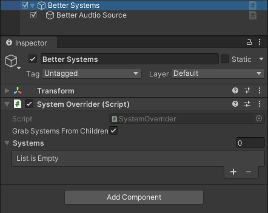

# Game Systems Locator

Singletons... **but better**

## About
This package provides a way to bootstrap and manage global game systems like saving or music.  
It allows for nice and centralized place to define and get systems as opposed to normal messy singleton spaghetti.

## Installation
To install the package, open Unity Package Manager


Then select "Add package from git URL..."  
Then type ` https://github.com/Wokarol/GameSystemsLocator.git#main ` as the URL  
> *If you want to target a specific version, suffix the URL with ` #version `, for example ` https://github.com/Wokarol/GameSystemsLocator.git#v0.2.0 `*

## Usage
### Bootstrapper
First, you have to **create a config class**.  
This class has to implement ` ISystemConfiguration ` interface and cannot be static.

> If you want to disable the boostrapper, you can use ` GAME_SYSTEMS_DISABLE_BOOTSTRAPPER ` compiler directive.  
> Keep in mind that you will have to initialize the locator yourself!

This interface defines a single method, ` void Configure(GameSystems.ConfigurationBuilder builder) ` which uses the builder passed as an argument to configure the locator.

Example of such class might look like so:
```cs
public class GameConfig : ISystemConfiguration
{
    public void Configure(ServiceLocatorBuilder builder)
    {
        builder.PrefabPath = "Systems";

        builder.Add<IMusicSource>(nullObject: new NullMusicSource());
        builder.Add<SaveSystem>(required: true);
        builder.Add<PlayerHandle>();
    }
}
```

If the ` PrefabPath ` is set, bootstrapper will spawn it and initialize the Locator with the systems present on the prefab. Prefab is loaded before scene is loaded.  
If the ` PrefabPath ` points to a folder, all the prefabs in that folder will be spawned underneath the main prefab. Or underneath a fresh game object if no main prefab is present.

If the ` PrefabPath ` has more than one entry, all present path will also be checked and all found prefabs will be spawned under the main prefab.

> For test scenes, you can add ` SkipSystemsPrefab ` to the name to not load the systems prefab. Locator will still be configured.  
> (when using additive scenes, all loaded scenes need that keyword otherwise systems prefab is spawned)

` .Add<T>(...) ` is used to add a game system container to the locator. Optionally it can define if the system is ` required ` or if it has a ` nullObject ` instance.

> For more information, refer to in-code documentation

### Locating
Locator configured like so can then be used to obtain references to game system using ` GameSystems.Get<IMusicSource>().Play() ` at any point in code

This method will get the current system even including the overrides, if no instance is present, it will attempt to return the null object.

You can also use ` GetWhenReady ` which accepts a callback which is called either immediately or when a system is added (Null Objects do not count). Ensure the object lives long enough to see the systems getting ready. Otherwise it might leave a dangling class reference in delegate.

### Overrides
Game Systems can be overwritten, for that attach ` SystemOverrider ` component to the game object with game systems that should be used as children. Like shown on the example:



No additional configuration is needed

> You can also pass the systems in a list directly, this will call ` GetComponent ` on them to retrieve a system.

> Currently enabling an overrider with ` Grab Systems From Children ` enabled loops over all systems calling ` GetComponentInChildren ` which might cause a performance hit. If you want to avoid it for systems that will never be overwritten. Use the ` noOverrides ` flag for a given system during locator setup.

## Can I?
#### 1. Create an instance of service locator instead of using static Game Systems class?
Yes, Service Locator is in ` GameSystemLocator.Core ` namespace
#### 2. Spawn different prefab(s) in debug and release?
Yes, you can do so by changing the PrefabPath property in Config like
```cs
if (/* is debug */)
    builder.PrefabPath = "Systems-Debug";
else
    builder.PrefabPath = "Systems";
```
You can use Prefab Overrides to make this process nicer.
Or you can do it by adding a target specific prefabs next to the main one.
```cs
builder.PrefabPath = "Systems";

if (/* is debug */)
    builder.PrefabPaths.Add("Systems-Debug");
else
    builder.PrefabPaths.Add("Systems-Release");
```

## Changelog
### v0.8.0
- **Add:** noOverride flag
- **Add:** createIfNotPresent flag
- **Add:** Setup System Locator tool
- **Add:** GetWhenReady
- **Fix:** Add missing type info to exceptions

### v0.7.1
- **Fix:** Systems prefab being removed after creation

### v0.7.0
- **Add:** Non-static Service Locator class
- **Change:** Complete overhaul of the code architecture


### v0.6.0
- **Add:** Option to disable bootstrapper
- **Add:** Option to not spawn systems prefab
- **Add:** SkipSystemsPrefab keyword
- **Change:** Game Systems API
- **Fix:** Bootstrapper loads after the scene is loaded


### v0.5.0
- **Add:** Systems list in System Overrider
- **Fix:** Having System Overrider enabled while the playmode is entered does not register systems properly

### v0.4.0
- **Add:** Readme content
- **Add:** Code documentation

### v0.3.0
- **Add:** System Overrider

### v0.2.1
- **Fix:** Created system has "(Clone)" suffix
- **Fix:** Failure to instantiate a prefab leaves empty object in the hierarchy

### v0.2.0
- **Rename:** ` AddSingleton ` to ` Add `
